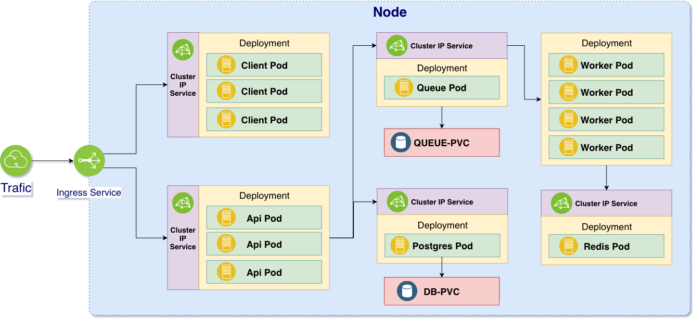
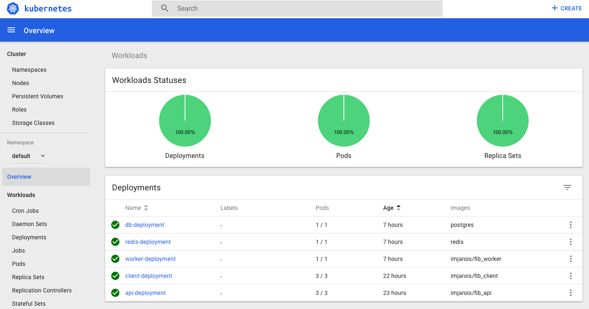
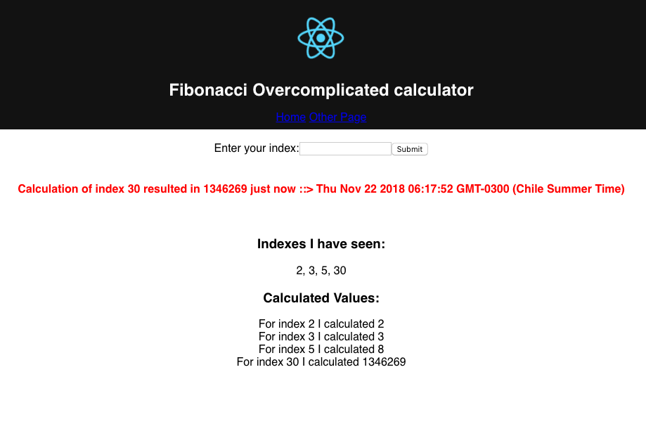

# Very Complex Fibonacci Calculator

> Overcomplicated Fibanacci calculator implementation.

This will allow me to register an scafolding template for Kubernetes Cluster configuration

## Cluster Architecture



<br />

## Applying Cluster Configuration

```shell
# At repository root
$ kubectl apply -f k8s
```

<br />

## Deleting Cluster Configuration

```shell
# At repository root
$ kubectl delete -f k8s
```

<br />

## Adding Secret Objects for password and encrypted data

```shell
$ kubectl create secret generic postgres-password --from-literal=POSTGRES_PASSWORD=pgpass123
```

<br />

## Setting the Ingress Service

Ingress controller used: __NGINX Ingress__

* Repository: https://github.com/kubernetes/ingress-nginx/

Mandatory command (applies to local and cloud)

```shell
$ kubectl apply -f https://raw.githubusercontent.com/kubernetes/ingress-nginx/master/deploy/mandatory.yaml
```

For specific use with minikube and cloud see [docs](https://kubernetes.github.io/ingress-nginx/deploy/)

<br />

## Local Deployed Kubernetes Cluster Dashboard



<br />

## App working



<br />